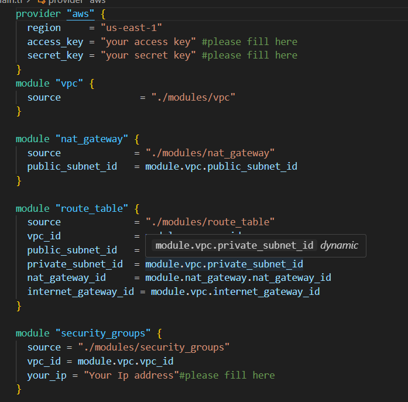

## Hướng dẫn sử dụng 
1. Clone project về :

Cách để clone project github về máy

https://docs.github.com/en/repositories/creating-and-managing-repositories/cloning-a-repository 

2. Thực hiện việc Download Terraform (nếu chưa tải về):

https://developer.hashicorp.com/terraform/install

3. Thực hiện chỉnh sửa các giá trị access_key, private_key và your_ip ở file main.tf tương ứng với access key, private key của AWS và địa chỉ IP hiện tại của bạn :



Cách lấy access key và private key của AWS : https://www.msp360.com/resources/blog/how-to-find-your-aws-access-key-id-and-secret-access-key/

4. Sử dụng 3 câu lệnh terraform sau để triển khai hạ tầng AWS

```` terminal
terraform init
````

````terminal
terraform plan
````

```` terminal
terraform apply
````

5. Sử dụng câu lệnh terraform test để thực hiện việc kiểm tra các instance đã được triển khai thành công hay chưa

```` terminal
terraform test
````